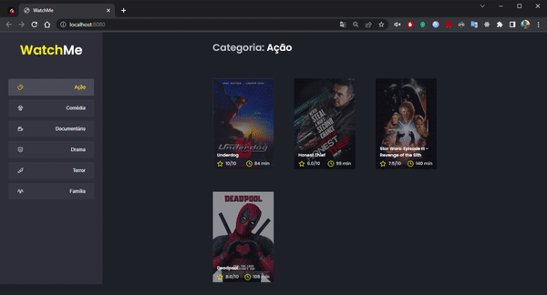
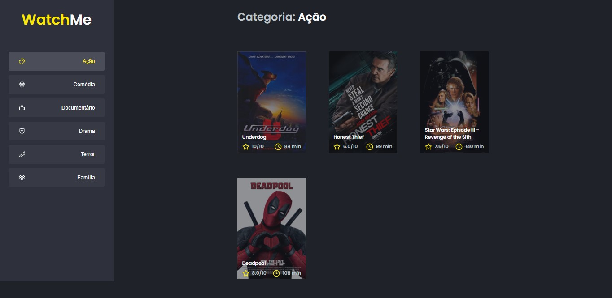

<h1 align="center">Watch Me</h1>

<p align="center">Esse projeto é uma aplicação que lista filmes por gênero selecionado.</p>

<p align="center">
 <a href="#demonstracao">Demonstração</a> •
 <a href="#tecnologias">Tecnologias</a> • 
 <a href="#pre-requisitos">Pré-requisitos</a> • 
 <a href="#configuracao">Configuração</a> • 
</p>
<hr />
<br />

<h2 id="demonstracao"> 📷 Demonstração </h1> 
<p> Veja como ficou essa aplicação: </p>
<div align="center">
  
  
</div>
<br />  

<h2 id="tecnologias"> 🚀 Tecnologias </h2> 
<p> Essas foram as tecnologias utilizadas nessa aplicação: </p>
<div>
  <ul>
    <li>
        </li>
    <li>
      
    </li>
    <li>
      
    </li>
    <li>
      
    </li>
    <li>
      
    </li>
  </ul>
</div>
<br />

<h2 id="pre-requisitos"> ✔ Pré-requisitos </h1> 
<p> Para rodar essa aplicação é preciso ter instalado as seguintes ferramentas: <strong>Git</strong>, <strong>Nodejs</strong> e um <strong>Editor</strong> de sua preferência.</p>
<div>
  
  
  
</div>  
<br />

<h2 id="configuracao"> ⚙ Configuração </h2>
<p> Realize essas configurações para rodar a aplicação: </p>
<p> Clone este repositório:</p>

```bash
$ git clone https://github.com/LucasMorais1998/watchme.git
```

<p> Acesse o a pasta da aplicação:</p>

```bash
$ cd watchme
```

<p> Instale as dependências:</p>

```bash
$ yarn
```

<p> Inicie o JSON Server:</p>

```bash
$ yarn server
```

<p> Execute a aplicação em ambiente de desenvolvimento:</p>

```bash
$ yarn dev
```

<p> O servidor irá iniciar na porta: 8080 - Acesse: </p>

```bash
http://localhost:8080
```

<p> Para visualizar os dados do JSON server utilize: </p>

```bash
http://localhost:3333/genres
http://localhost:3333/movies
```
